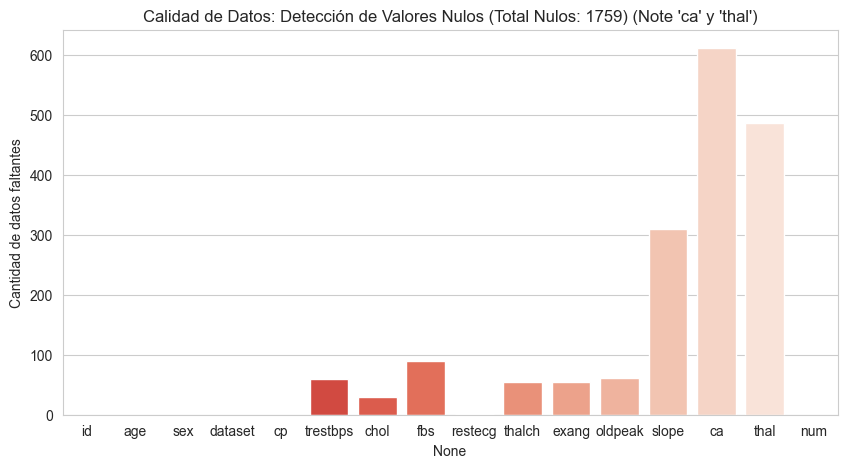
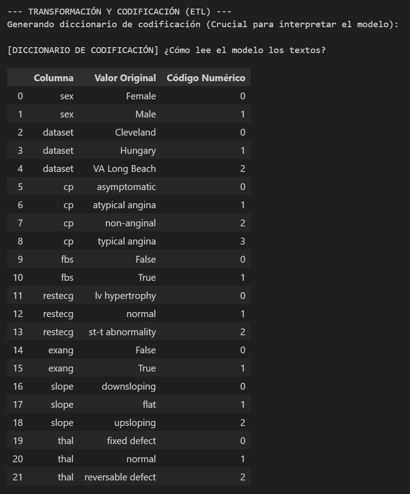
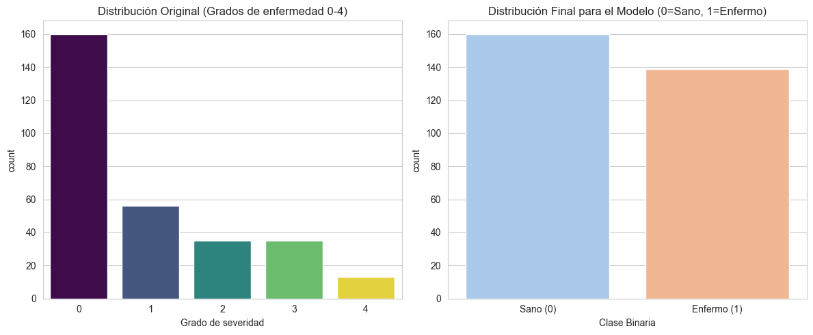
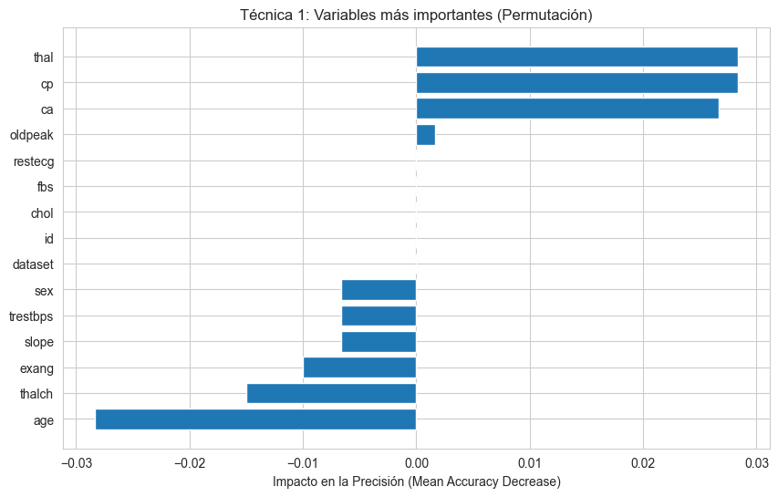
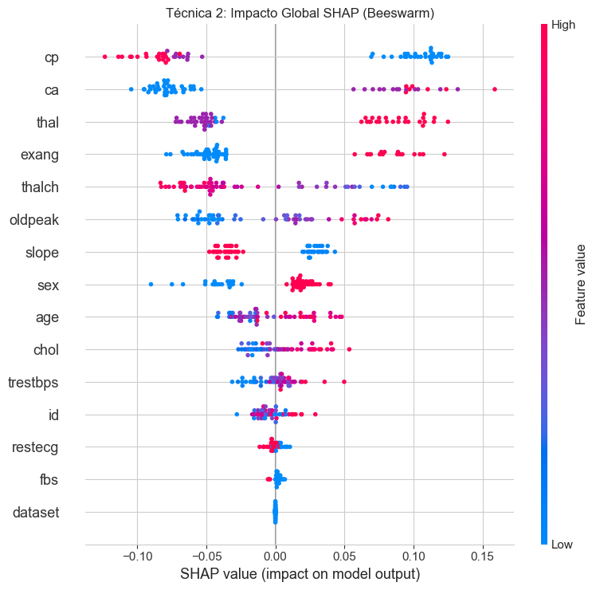
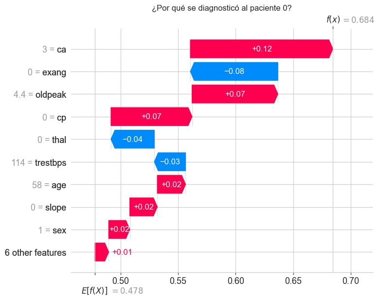
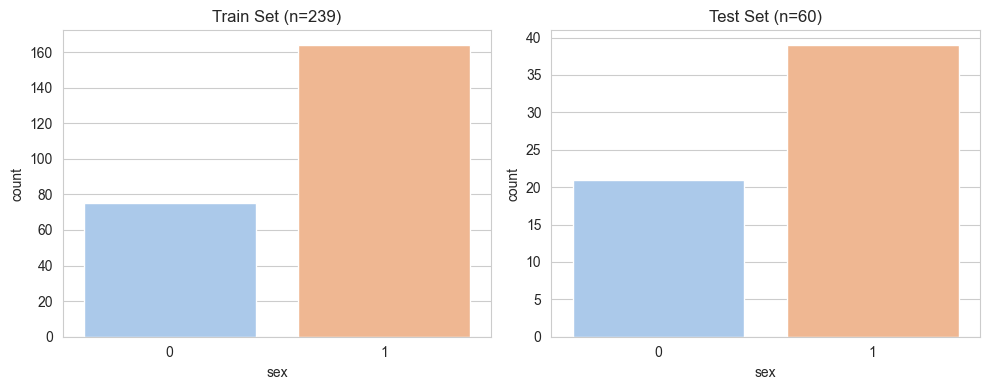
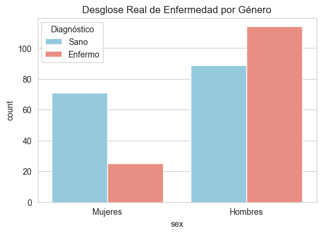
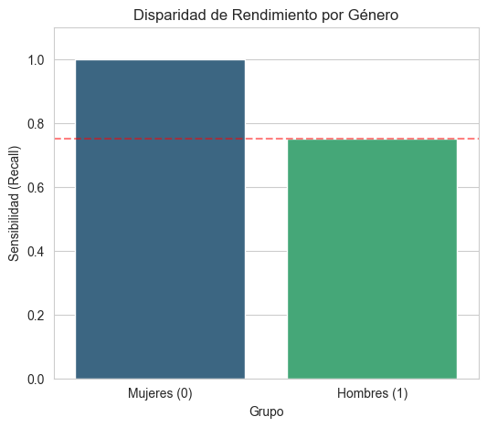

# 🫀 Predicción de Enfermedad Cardíaca: Un Enfoque Transparente y Ético (XAI)

### 📋 Resumen del Proyecto
Este proyecto implementa un modelo de Machine Learning (Random Forest) para predecir la presencia de enfermedades cardíacas utilizando el dataset **Heart Disease UCI** (combinado).

El objetivo central no es solo maximizar la precisión, sino garantizar la **Calidad del Dato**, la **Transparencia (XAI)** y realizar una **Auditoría Ética** rigurosa para detectar discriminación algorítmica antes de un hipotético despliegue médico.

---

## 1. 📊 Gestión de Calidad de Datos

Se utilizó el dataset combinado que incluye 4 bases de datos (Cleveland, Hungría, Suiza, Long Beach VA) con un total inicial de **920 registros**.

### 1.1 Auditoría y Limpieza Rigurosa
Durante la exploración de datos (EDA), detectamos un problema crítico:
* **El Problema:** Las bases de datos de Hungría, Suiza y Long Beach no registraron consistentemente variables vitales como `ca` (número de vasos mayores coloreados por fluoroscopia) y `thal` (tipo de talasemia). Estas columnas presentaban un **>60% de valores nulos**.
* **La Decisión:** Priorizamos la **integridad clínica** sobre el volumen de datos.
* **La Acción:** Se aplicó un filtrado estricto (`dropna`), descartando los registros incompletos.
    * *Resultado:* El dataset se redujo a **299 pacientes** (principalmente del estándar de oro de Cleveland).
    * *Justificación:* Imputar (inventar) datos complejos como una fluoroscopia o un defecto genético (talasemia) introduciría ruido inaceptable en un modelo de salud, alucinando explicaciones en la fase de XAI.

**Auditoría de Nulos (Antes de la limpieza):**
> 

---

## 2. ⚙️ Metodología y Pre-procesamiento

Para preparar los datos para el modelo Random Forest, aplicamos:

### A. Traducción de Variables (Label Encoding)
El dataset contenía variables categóricas en texto (ej: "Typical Angina", "Male"). Se codificaron numéricamente y se generó un diccionario para mantener la interpretabilidad.

**Diccionario de Mapeo:**
> 

### B. Simplificación del Objetivo (Target Binarization)
La variable `num` original clasifica la enfermedad del 0 al 4.
* **Transformación:** Simplificamos el problema a **Clasificación Binaria**.
    * `0` = Sano
    * `1, 2, 3, 4` $\rightarrow$ **1 (Enfermo)**
* **Motivo:** Las clases severas (3 y 4) tenían muestras insuficientes, lo que hubiera impedido el aprendizaje del modelo.

**Distribución de Clases:**
> 

---

## 3. 🤖 Entrenamiento del Modelo

* **Algoritmo:** Random Forest Classifier.
* **Configuración:** 100 árboles, profundidad máxima de 5 (para evitar sobreajuste).
* **Métricas Globales:** El modelo alcanzó una precisión (Accuracy) del 85%, en el set de prueba depurado.

---

## 4. 🔍 Explicabilidad (XAI)

Para validar la lógica médica del algoritmo, utilizamos dos técnicas de Caja Blanca:

### Técnica 1: Permutation Feature Importance
Mide qué tanto cae el rendimiento del modelo si eliminamos la información de una variable.

**Variables Más Importantes:**
> 

* **Hallazgo:** El modelo depende fuertemente de `cp` (Dolor de pecho), `thal` (Talasemia) y `ca` (Vasos), lo cual coincide con la literatura cardiológica.

### Técnica 2: SHAP (Global y Local)
Analiza el impacto positivo o negativo de cada síntoma.

**Resumen Global (Beeswarm):**
> 

### Explicación de un Caso (Paciente #0)
Desglosamos la decisión del modelo para el primer paciente del set de prueba.

**Gráfico Waterfall:**
> 

* **Interpretación:** Podemos ver exactamente qué síntomas (barras rojas) empujaron al modelo a diagnosticar enfermedad y qué factores protectores (barras azules) intentaron mitigar el riesgo.

---

## 5. ⚖️ Auditoría Ética y Sesgos

Se evaluó el principio de **Justicia (Fairness)** auditando el balance de datos y el rendimiento por género, siguiendo una secuencia lógica de verificación.

### 5.1 Auditoría de Representatividad (Train vs Test)
Primero, verificamos si el modelo tuvo suficientes oportunidades para estudiar ambos géneros.

**Verificación de Balance:**
> 

* **Datos:** El modelo se entrenó con una **clara mayoría de hombres (aprox. 65%)** y una minoría de mujeres (35%).
* **Hipótesis de Riesgo:** Al tener significativamente menos ejemplos de mujeres para aprender ("estudiar"), existe un riesgo estadístico alto de que el modelo no logre generalizar bien en este grupo.

### 5.2 Análisis de Enfermedad Real (Ground Truth)
Auditamos la tasa real de enfermedad en el dataset completo para entender la dificultad del diagnóstico.

**Desglose de Enfermedad Real por Género:**
> 

* **Datos Reales:**
    * **Mujeres:** Solo el **26%** presentaba enfermedad. El modelo tuvo que aprender a detectar "Mujeres Enfermas" con una muestra extremadamente reducida (solo 25 casos positivos en total).
    * **Hombres:** La mayoría (**56%**) estaba enfermo, proporcionando abundantes ejemplos positivos al algoritmo.

### 5.3 Disparidad de Rendimiento y "La Paradoja"
Finalmente, evaluamos la métrica crítica de **Sensibilidad (Recall)** para ver cómo afectaron los desbalances anteriores al diagnóstico final.

**Gráfico de Disparidad:**
> 

### 🚨 Resultados y Conclusión de la Auditoría:
Los resultados contradicen la intuición estadística, revelando una **Paradoja de la Minoría**:

1.  **Sensibilidad en Mujeres (1.00):** A pesar de la escasez de datos (puntos 5.1 y 5.2), el modelo detectó el **100%** de los casos de enfermedad en mujeres. Esto sugiere que los patrones clínicos de infarto femenino en este dataset son muy distintivos y separables.
2.  **Sensibilidad en Hombres (0.75):** A pesar de ser la mayoría, el modelo falló al detectar la enfermedad en el **25%** de los hombres enfermos.
3.  **Veredicto de Sesgo:** Existe una brecha de rendimiento del 25% que penaliza a los hombres. El modelo es **injusto**, no por falta de datos masculinos, sino posiblemente por la complejidad/ruido de sus síntomas frente a la claridad de los femeninos.
---

## 6. 📝 Conclusiones y Recomendaciones

1.  **Calidad sobre Cantidad:** La decisión de descartar el 60% de la data fue correcta para garantizar que las explicaciones (SHAP) se basaran en datos clínicos reales y no imputados.
2.  **Transparencia:** Las herramientas XAI demostraron que el modelo "piensa" correctamente (usa las variables médicas adecuadas), pero eso no garantiza que sea justo.
3.  **Recomendación de No-Despliegue:** A pesar de la buena precisión global (85%), **el modelo no debe pasar a producción**.
    * La disparidad de sensibilidad contra los hombres (25% de falsos negativos) es éticamente inaceptable.
    * **Próximos pasos:** Se requiere recolectar más datos de **hombres con cuadros clínicos complejos** para mejorar su detección y validar el modelo con una muestra externa de mujeres para asegurar que el 100% de éxito no sea un artefacto estadístico por el tamaño de la muestra.

---

### 💻 Pasos para Ejecutar el Proyecto

Para reproducir estos resultados en tu máquina local, sigue estos pasos:

#### 1. Prerrequisitos
Asegúrate de tener **Python** instalado (versión 3.8 o superior). Puedes verificarlo ejecutando:

```bash
python --version
```

Si no lo tienes, descárgalo desde python.org.

2. Clonar el Repositorio

Descarga el código fuente a tu computadora:

```bash
git clone https://github.com/JavierVMC29/maestria-ia-ml-actividad4-grupo2.git
```

```bash
cd TU_REPOSITORIO
```
3. Configurar el Entorno Virtual (Recomendado)

Crea y activa un entorno virtual para no afectar tu instalación global de Python:

Windows:
```bash
python -m venv venv
```
```bash
.\venv\Scripts\activate
```
Mac/Linux:
```bash
python3 -m venv venv
```

```bash
source venv/bin/activate
```

4. Instalar Dependencias

Instala todas las librerías necesarias ejecutando:

```bash
pip install -r requirements.txt
```

(El archivo requirements.txt incluye: pandas, numpy, scikit-learn, shap, matplotlib, seaborn).

5. Ejecutar en VS Code

    1. Abre la carpeta del proyecto en Visual Studio Code.

    2. Instala la extensión "Jupyter" de Microsoft (búscala en la pestaña de Extensiones).

    3. Abre el archivo del notebook (ej: main.ipynb).

    4. En la esquina superior derecha, selecciona el Kernel y elige tu entorno virtual (venv).

    5. Haz clic en "Run All" para ejecutar todo el análisis.

¡Listo! Ahora podrás ver los gráficos y resultados.